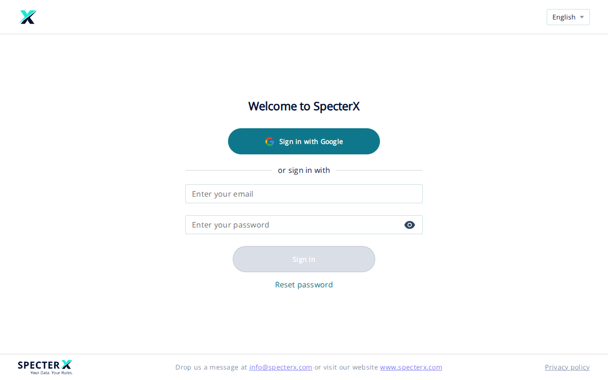

# Sign in to SpecterX

Use this article to sign in to SpecterX from a browser. Your administrator must create your account before you can sign in.

## Before you start

You need:

- A SpecterX account. Your administrator creates accounts; self-service sign-up is not available.
- Your organization's sign-in URL. Most users go to `https://app.specterx.com`. Some organizations use a tenant-specific subdomain such as `https://yourorg.specterx.com` — if your administrator gave you a different URL, use that one.

## Steps

1. Go to your SpecterX sign-in URL.

   

2. Sign in using one of the available methods:
   - Click **Sign in with Google** if your organization uses Google SSO.
   - If your organization uses another identity provider (for example, Microsoft Entra ID or Okta), click the SSO option shown on your sign-in page and complete your provider's prompts.
   - If your organization uses email and password, enter your email address, enter your password, and click **Sign In**.

3. Confirm that SpecterX opens your default page. For most users, this is **My Files**.

## Troubleshooting

### Your email or password is not accepted

Check that you are using the email address your administrator registered. Passwords are case-sensitive. If you have forgotten your password, click **Reset password** below the **Sign In** button. See [Set or reset your password](../02-set-or-reset-password/02-set-or-reset-password.html) for the full procedure.

### You cannot sign in after SSO

Your identity provider accepted your sign-in, but your SpecterX account may not be active. Contact your administrator and ask them to confirm that your SpecterX user exists and matches your identity provider email address.

### Your account is not recognized

Your account may not have been created in SpecterX yet. Sign-up is administrator-driven. Contact whoever manages SpecterX at your organization.

### The sign-in page does not load

Confirm that you typed the URL correctly. If your organization uses a tenant-specific subdomain, you need that exact URL. If the URL is correct and the page still does not load, check your internet connection or try a different browser.

### The sign-in page keeps reloading after you click Sign In

Your browser may be blocking cookies for SpecterX. Allow cookies for your sign-in domain and try again.

## Related articles

- [Set or reset your password](../02-set-or-reset-password/02-set-or-reset-password.html)
- [What is SpecterX?](../03-what-is-specterx/03-what-is-specterx.html)

---

*Last validated against the live SpecterX production tenant at `app.specterx.com` on 2026-05-26.*
