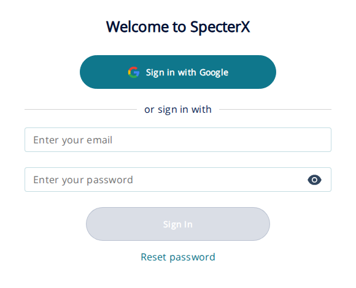
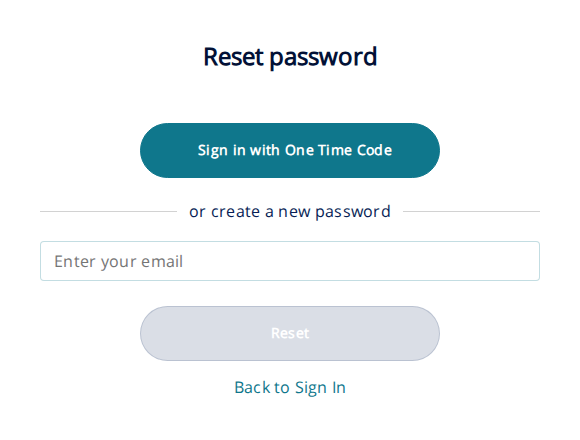
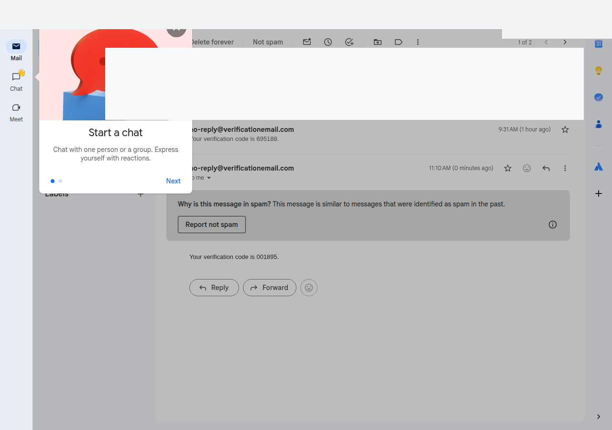
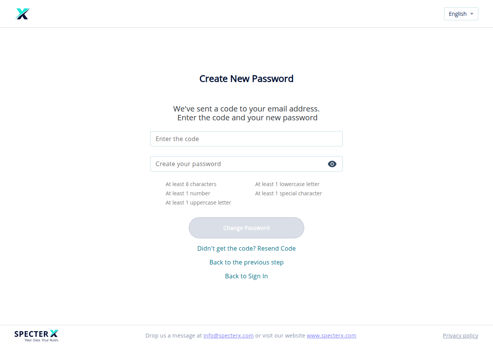

# Set or reset your password

If you've forgotten your SpecterX password, or you're setting one for the first time, follow the steps below to request a code by email and pick a new password.

If your organization signs you in to SpecterX through Google Workspace, Microsoft / Entra ID, or Okta, these steps don't apply to you. See **If you sign in with SSO** below.

## Before you start

You need:

- A SpecterX account. Accounts are created for you when your organization adds you or when someone shares data with you. Self-service sign-up isn't available. Without an account, SpecterX shows "You must be invited before you can sign in" and the procedure below won't work.
- Access to the inbox of the email address linked to your SpecterX account. That's where the code goes.
- Your organization's SpecterX sign-in URL. Every tenant has its own URL on the `specterx.com` domain, such as `https://yourorg.specterx.com`. If your administrator gave you a different URL, use that one. Don't default to `app.specterx.com`. That's one specific tenant's URL, not a shared address.

## Steps

1. Go to your SpecterX sign-in URL and click **Reset password** under the **Sign In** button.

   

2. On the **Reset password** page, type the email address registered to your SpecterX account in the **Enter your email** field, then click **Reset**.

   

   SpecterX sends a 6-digit verification code to that email address. The code is valid for one hour.

3. Open the email and copy the code. The message comes from an `@specterx.com` sender. It may be delivered through a transactional-email provider such as `verificationemail.com`. If you don't see it within a minute or two, check your spam or junk folder.

   

4. Back on the SpecterX page, the title changes to **Create New Password**. Type the code in the **Enter the code** field.

   

   If you didn't receive the code, click **Didn't get the code? Resend Code**. You can request a new code once every 60 seconds. Each new request invalidates the previous code.

5. In the password field below the code, type your new password. SpecterX checks the password as you type. All five rules must turn green before the **Change Password** button becomes active:

   - At least 8 characters
   - At least 1 uppercase letter
   - At least 1 lowercase letter
   - At least 1 number
   - At least 1 special character. Allowed special characters: `! @ # $ % ^ & * ( ) _ ~ -`

6. Click **Change Password**. SpecterX confirms with the message "Your password has been successfully changed" and returns you to the sign-in page. Sign in with your email address and the new password.

   

## If you sign in with SSO

If your organization uses Google Workspace, Microsoft / Entra ID, or Okta to sign you in to SpecterX, the password you use to reach SpecterX lives with your identity provider, not with SpecterX. The **Reset password** link on the SpecterX sign-in page won't change that password.

To reset an SSO password, use your identity provider's own self-service tools, or contact whoever manages identity at your organization. Once your identity provider accepts your new credentials, sign in to SpecterX the way you normally would.

## Troubleshooting

### The reset email never arrives

Check your spam or junk folder first. If it isn't there:

- Confirm you entered the email address your administrator registered. SpecterX doesn't tell you whether an address is registered. If you enter a typo or an unregistered address, the page looks the same as a successful submission.
- Add `@specterx.com` to your email allowlist or address book and try again.
- If you still don't receive the code after several minutes, contact your administrator. Your account may not be fully provisioned yet.

### "Wrong code" or the code is rejected

The code is six digits. After three wrong attempts, SpecterX returns you to the sign-in page and you have to request a new code. Click **Reset password** again, request a fresh code, and use the newest one you received. The previous codes stop working.

### The code expired

Codes expire one hour after they're sent. Start over: click **Reset password** on the sign-in page and request a new code.

### The Reset password link is missing or doesn't respond

Some organizations require an administrator to reset passwords on behalf of users. If the **Reset password** link doesn't appear on your sign-in page, or clicking **Reset** does nothing, contact your administrator and ask them to reset your password for you.

### You expected an activation email but it never arrived

The first-time activation email uses the same delivery path as the reset email. Check your inbox, your spam folder, and your email allowlist. If it isn't in any of those, ask your administrator to resend it from the admin console.

### You see "You must be invited before you can sign in"

Your email address isn't associated with an active SpecterX account. Contact whoever manages SpecterX at your organization and ask them to invite you.

## What this article doesn't cover

- Changing your password while you're signed in. SpecterX has no in-app change-password screen for end users; the **Reset password** flow above is the only path.
- Resetting an administrator's password for the SpecterX admin portal (`admin.specterx.com`). That's a separate flow in a separate application.
- Resetting a password stored at your identity provider (Google, Microsoft, Okta). Use your provider's own tools.

## Related articles

- [Sign in to SpecterX](../01-log-in-to-specterx/01-log-in-to-specterx.html)
- [What is SpecterX?](../03-what-is-specterx/03-what-is-specterx.html)
