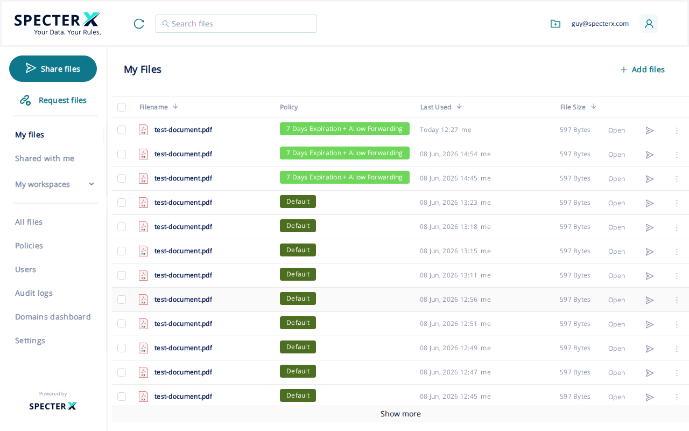
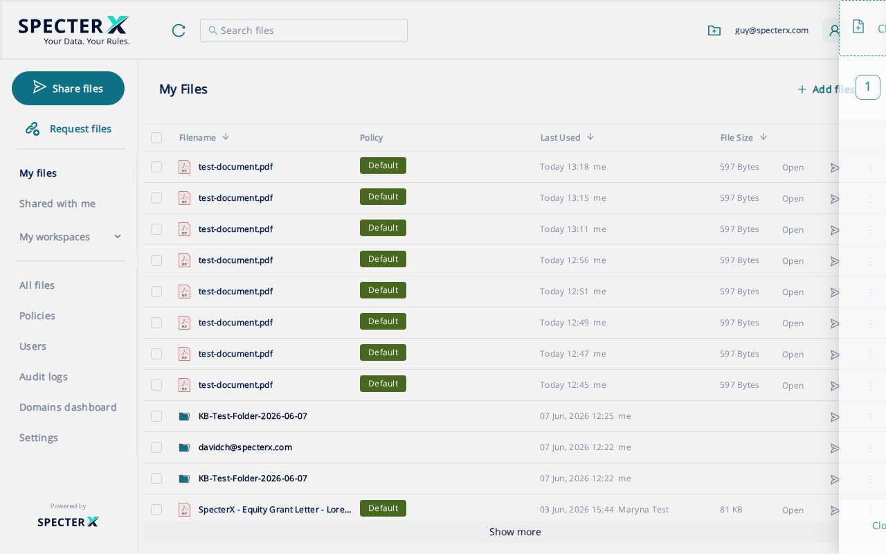
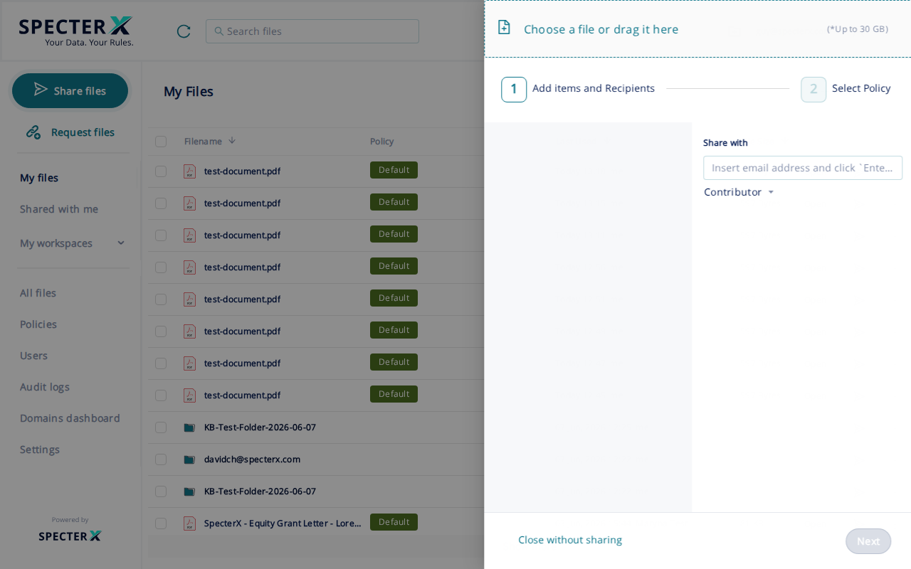
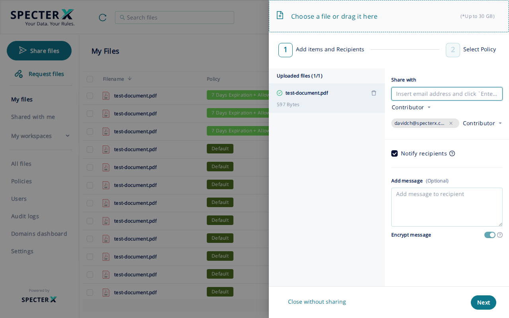
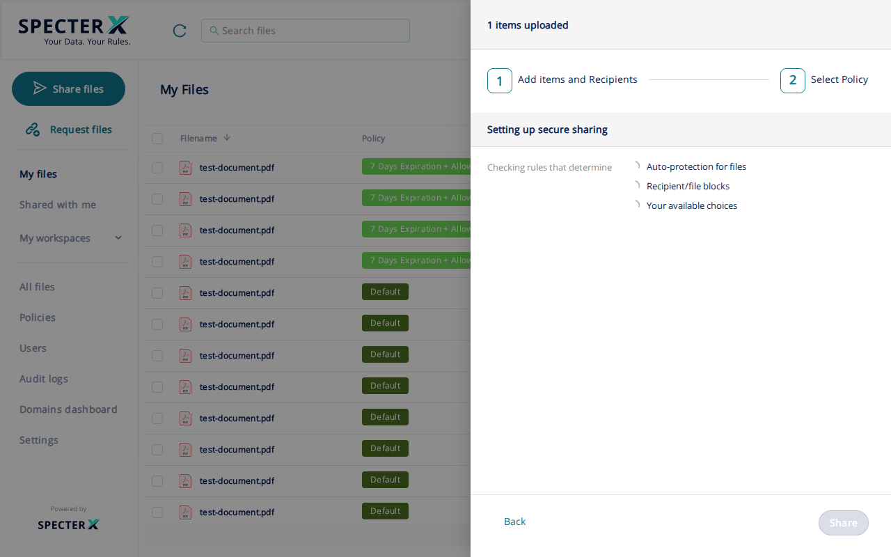
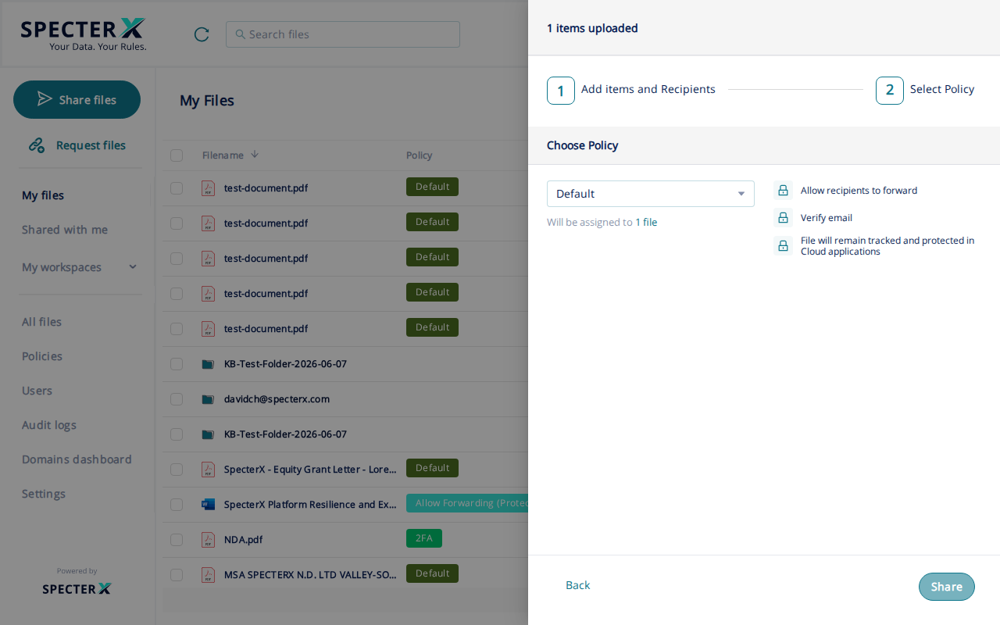
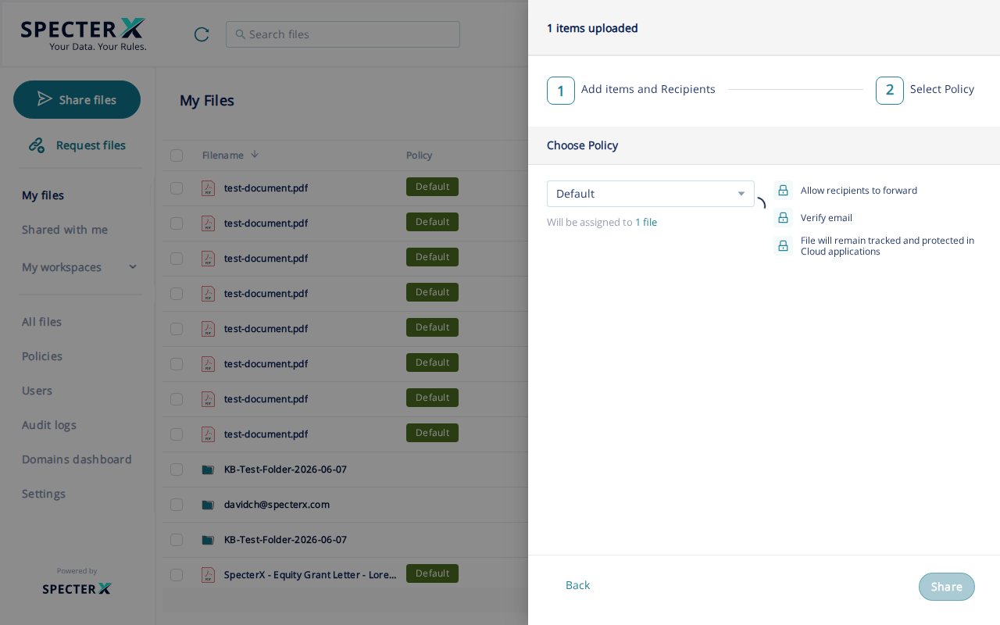
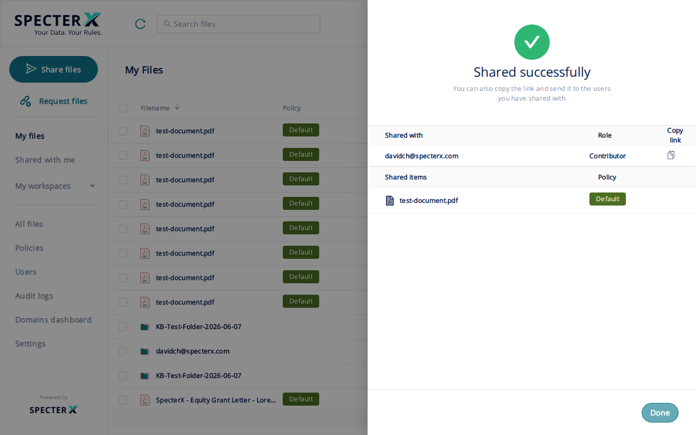
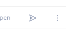
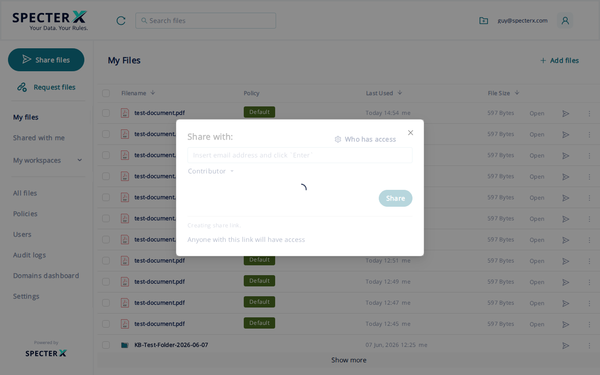

# Securely share a file from the SpecterX web platform

To share files from SpecterX, use the **Share Files** drawer on the **My Files** page. The policy you pick controls what recipients can do with the files.

## Before you start

You need:

- An active SpecterX session in your browser. If you haven't signed in yet, see [Sign in to SpecterX](../01-log-in-to-specterx/01-log-in-to-specterx.html).
- The file or files you want to share. They can be files already in **My Files**, new uploads from your computer, or a mix of both.
- The email address of each recipient.
- A phone number for each recipient, in international format, if you plan to use a policy that requires SMS verification. Your administrator decides which policies require this.

## Steps

### 1. Open the Share Files drawer

On the **My Files** page, click **Share files**.

The **Share Files** drawer opens on the right of the page with the first step, **Add items and Recipients**, already showing.

### 2. Add files

In the upload area at the top of the drawer, **Click or drag a file to this area to upload**. The file uploads as soon as you drop it. Wait for the upload bar to finish before you continue.

If your files are already in **My Files**, you don't need to start here. Go to the **My Files** page, select the file or files you want to share, and click **Share files**, or click the **Share** action on a single file's row. The drawer opens with those files pre-loaded. You can add more files in the upload area if needed, then continue with step 3.

### 3. Add a recipient

Below the upload area, in the **Share with** block, the recipient field shows the placeholder **Insert email address and click `Enter`**.

Type the recipient's email address and press **Enter**. The address moves into a recipient row below the field.

Repeat this for every recipient you want to add.

### 4. Set each recipient's permission level

Each recipient row has a role dropdown set to **Viewer** by default. Open the dropdown and pick the level you want:

- **Viewer**. Can view the file. This is the default.
- **Contributor**. Can view and edit the file's content. Whether they can also download depends on the policy you select in step 6.
- **Co-owner**. Can view, edit, reshare the file with new recipients, and read the file's audit log.

A Contributor or Co-owner can't override the policy: if the policy blocks downloads, even a Co-owner sees the same Secure Viewer with no download button.

### 5. Continue to the policy step

Click **Next** at the bottom of the drawer. SpecterX checks your organization's auto-protection rules before presenting policy options. The drawer shows **Setting up secure sharing** briefly while this runs.

When the check finishes, the **Select Policy** step appears.

### 6. Pick a security policy

From the **Choose Policy** dropdown, pick the policy that matches the sensitivity of the file. Your administrator defines the available policies. The dropdown shows only those allowed for your account.

If a Platform Governance Rule applies to this share, the policy is already chosen and the heading reads **Choose or Review Policy** instead. You can review the assigned policy but you can't change it.

If no policy in the list fits the share, ask your administrator to add one.

### 7. Enter any extra recipient details the policy needs

Some policies require an additional piece of information per recipient before SpecterX will create the link:

- **Phone (SMS) verification.** An **Add phone number** action appears next to each recipient. Click it and enter the recipient's phone number in international format, for example `+1 555 000 1234`.
- **Personal secret.** An **Add password** action appears next to each recipient. Click it and enter the secret you've agreed with the recipient out of band.

If any required detail is missing, the banner **One or more of the recipients' phone numbers are missing. Please complete them.** stays at the top of the drawer and **Share** stays disabled.

Skip this step if the policy you picked doesn't ask for either.

### 8. Send the share

Click **Share**. The drawer moves to the **Confirm** step and shows **Sharing Successful** along with a one-line summary listing how many files were shared and who they went to.

Each recipient receives a notification email with the protected link. SpecterX sends it automatically unless you turned off **Notify recipients** earlier in the flow.

### 9. Copy the protected link

To send the link through another channel (a chat message, a calendar invite), click **Copy Link** on the **Confirm** step. SpecterX copies the link to your clipboard. The link is the same one every recipient received by email, and it's already governed by the policy you picked.

## After you share: the Share & Permissions panel

To check who has access to a file you've already shared, or to change something after the share is live, use the **Share & Permissions** panel from **My Files**.

1. In **My Files**, find the file you shared. Each row has action icons at the right edge. Look for the outward-pointing arrow (the share icon).

   Click the share icon. The **Share with** panel opens in the center of the page, showing the current share link and a **Who has access** option at the top right.

   Click **Who has access** at the top of the panel to see all recipients and their current access level.

2. From the **Who has access** view you can:

   - Change a recipient's role from the dropdown next to their email address.
   - Add a new recipient under **Add New Recipients**.
   - Revoke a recipient's access using the **Revoke** action on their row.
   - Change the policy from the **Parent policy** dropdown.

Changes take effect the next time the recipient opens the protected link. Anyone with the file already open in the Secure Viewer won't see the change until they reload.

## What recipients experience

Each recipient receives an email from an `@specterx.com` sender with a link to the protected file. When they click the link, they land on the **Recipient Page** and verify their identity. For most recipients, this means entering a 6-digit code sent to their inbox. After verification, the file opens in the **Secure Viewer**.

Whether they can download, forward, or print the file depends on the policy you picked in step 6, not on the role you gave them.

Recipients don't need a SpecterX account. SpecterX provisions them automatically when you add them to the share.

## Troubleshooting

### The Share button stays disabled

One of the required pieces is missing. Look at the top of the drawer for the message it shows:

- **Please add files to share**. The upload didn't finish, or no file was added.
- **Please add recipients to share**. At least one recipient must be added.
- **Recipient wasn't added. Please click on "Add" button**. You typed an address but didn't press Enter to commit it.
- **Some files are still uploading. Please wait until they finish uploading**. Wait for the upload bar to finish.
- A missing phone number or password banner. The selected policy needs that detail for every recipient.

### "Invalid email address" appears as you type a recipient

The address isn't in `name@example.com` form. Check for typos, then press Enter again.

### A message says you've already shared this file with the recipient

If you see **You have already shared this file with {recipient}**, the address is already on the file's recipient list. Use the **Share & Permissions Drawer** on the file to review or change that recipient's access instead.

### A recipient says they didn't get the notification email

Ask them to check their spam or junk folder. The notification comes from an `@specterx.com` sender and may be routed through a transactional-email provider. If it still doesn't arrive after a few minutes, open the **Share & Permissions Drawer**, confirm the recipient's email address is correct, and remove and re-add the recipient if it needs correcting.

### A recipient sees "Access denied" on the Recipient Page

The address on the protected link may not match the address the recipient used to verify. Open the **Share & Permissions Drawer**, check the address you have on file, and correct it if needed. If the address is right but they still can't open the file, the policy may require a verification method the recipient hasn't completed, for example a phone number that hasn't been entered for them.

## Related articles

- [Sign in to SpecterX](../01-log-in-to-specterx/01-log-in-to-specterx.html)
- [What is SpecterX?](../03-what-is-specterx/03-what-is-specterx.html)
