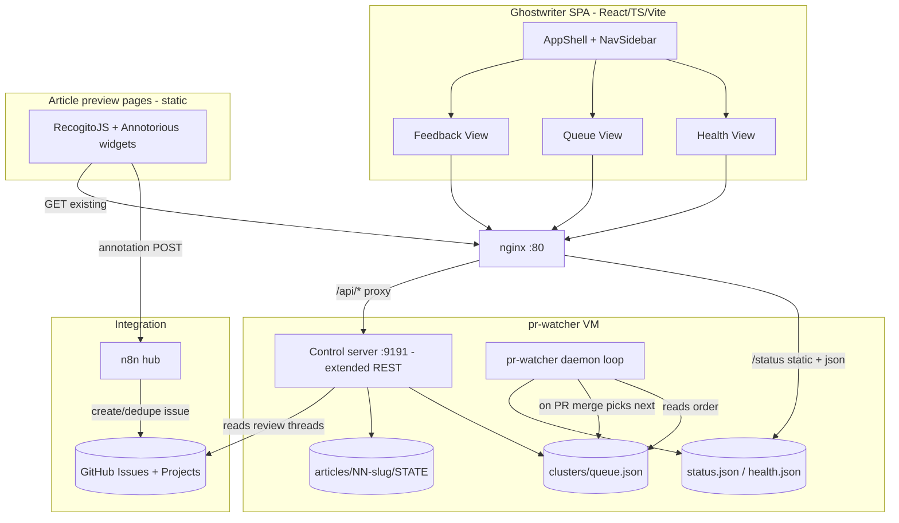

# SpecterX Ghostwriter — KB Review & Operations Platform

> Status: **proposed** (design note for circulation, not yet implemented).
> Branch: `claude/article-review-workflow-zfpF7`.
> This document merges two plans: the **Ghostwriter SPA / queue-as-data**
> platform and the **KB Feedback Loop** feature. Authentication (e.g. Google
> SSO via `oauth2-proxy`) is intentionally **out of scope** here — see
> [Deferred / open](#deferred--open-decisions).

## Why these are one plan

Ghostwriter is the **platform**; the feedback loop is a **feature that rides
its rails**. They share three seams, so building them separately would
duplicate work:

| Shared seam | Ghostwriter provides | Feedback loop needs |
|---|---|---|
| **Frontend home** | a multi-view SPA (Health, Queue) | a PM-facing triage UI → a **third view: Feedback** |
| **Control-plane API** | `GET/PUT /api/queue`, `POST /api/queue/trigger` | re-entry trigger + an annotation read API → **fold into the same REST surface** |
| **`STATE` merge + queue advance** | `queue_store` merges live `STATE` and picks the next article | the `MERGED → REVISING → MERGED` cycle (`REVISION_CYCLE`, `PUBLISH_STALE`) → **handled in `queue_store`** |

Net effect of merging:

- Re-entry of a merged article for a revision is **not** a new endpoint —
  it is `POST /api/queue/trigger` with revision semantics (the same "write
  this next" action the Queue view already exposes).
- The feedback triage board is **not** a separate tool — it is the
  Ghostwriter **Feedback** view. (GitHub Projects stays available as an
  optional secondary surface for people who live in GitHub.)
- The pipeline still terminates per-article at `MERGED`; `queue_store` owns
  the cycle that lets a merged article re-enter without re-triggering the
  next cluster article.

## Architecture



The queue stops being code: `CLUSTER_1_ARTICLES` is replaced by
`clusters/queue.json`, which both the daemon and the API read/write. Article
phase stays authoritative in each `articles/NN-slug/STATE` (per `CLAUDE.md`);
the API merges queue ordering + live `STATE` for display.

---

# Part A — Ghostwriter platform

## A1. Queue data model (new editable source of truth)

Create `clusters/queue.json` (machine-readable; `editorial/ARTICLES_PLAN.md`
stays the human backlog):

```json
{
  "version": 1,
  "updated_at": "2026-06-04T12:00:00Z",
  "clusters": [
    {
      "id": "01-login",
      "title": "Login & Account",
      "mode": "serial",
      "scenario": true,
      "status": "in_progress",
      "pause_after": "03-what-is-specterx",
      "articles": [
        { "slug": "01-log-in-to-specterx", "title": "Log in to the SpecterX web platform" },
        { "slug": "02-set-or-reset-password", "title": "Set or reset your password" },
        { "slug": "03-what-is-specterx", "title": "What is SpecterX?" }
      ]
    }
  ]
}
```

- `mode`: `serial` (one at a time) or `parallel` (trigger all at once).
- `pause_after`: stop and wait for a human after this slug merges (replaces
  the hardcoded cluster-1 review pause).
- Per-article `state` is NOT stored here; it is read live from
  `articles/<slug>/STATE`.
- Seed it from the current `clusters/01-login/articles.txt` + the hardcoded
  `CLUSTER_1_ARTICLES`.

## A2. Backend: shared queue module + API

- New `ops/pr-watcher/queue_store.py`: `load_queue()`, `save_queue()`,
  `next_article(merged_slug)` (cluster-aware: serial advance, cluster
  rollover, `pause_after`, parallel fan-out), and `queue_with_states()` that
  merges `articles/<slug>/STATE` (reuse `read_state()` logic from
  [pipeline/build_index.py](pipeline/build_index.py)). **`next_article()`
  also owns the revision-cycle guard** (see [Part B](#b4-re-entry-into-the-pipeline)):
  it does not advance the cluster when the just-merged article had
  `REVISION_CYCLE > 0`.
- Rewire [ops/pr-watcher/pr-watcher.py](ops/pr-watcher/pr-watcher.py): delete
  `CLUSTER_1_ARTICLES`; `trigger_next_article()` calls
  `queue_store.next_article()`; respect `pause_after`/`status`.
- Extend `_ControlHandler` (currently only `POST /poll-now`, `/retry`) into a
  small REST surface — see the [unified API table](#reconciled-control-plane-api).

## A3. Frontend: Ghostwriter SPA

New app at `ops/ghostwriter/` (Vite + React + TS strict, SCSS modules, no Ant
unless needed). Follows the workspace rules (functional components, `@/*`
alias, `VITE_*` env, files ≤200 LOC, `Component.module.scss` per component).

- **Design tokens** ported from `admin-web-client/DESIGN_CHEATSHEET.md` into
  `src/styles/_tokens.scss`: teal `#023632`, canvas `#F8F8FA`, white cards,
  `Inter`, radii `10px`/`4px`, light borders `rgba(0,0,0,0.06)`. Light theme
  (PM/content-creator facing), not the GitHub-dark health page.
- **Shell**: `AppShell` + `NavSidebar` (Ghostwriter logo, nav: **Health,
  Queue, Feedback**) + light grey `main-content` canvas + per-page
  `PageHeader` (one `<h1>` + subtitle + right-aligned actions).
- **Health view** (`src/views/health/`): port the existing
  [dashboard/index.html](ops/pr-watcher/dashboard/index.html) panels (hero
  status, uptime, activity counters, active-task track, tool log, watched
  PRs, failed comments, poll log) into React components, restyled to the
  light theme. Same data: `status.json`, `health.json`, `/task-log`,
  `POST /poll-now`, `/retry`.
- **Queue view** (`src/views/queue/`): master-detail per design cheatsheet.
  - Left: cluster side-selector (white, selected = teal left-border + tint).
  - Right: ordered article list with drag-to-reorder, phase badges
    (`PLANNED → … → DONE`), a clear "Next up" marker, cluster
    `mode`/`pause_after` controls, add/remove article (from
    `ARTICLES_PLAN.md` backlog), and a "Write this next" action.
  - For an in-flight article, render the 6-step **comment-resolution track**
    from `status.json.current_task` (reuse the bulb-rail concept).
  - Surface the **`PUBLISH_STALE`** flag (re-merged article whose Zendesk
    copy is now out of date) as a badge + reminder.
- **Feedback view** — see [Part B](#b5-feedback-view-triage-in-the-spa).
- **Data layer**: React Query hooks in `src/api/` (typed to the JSON
  payloads) + mutations for `PUT /api/queue` / `POST /api/queue/trigger`;
  dirty-guard + toast feedback per cheatsheet. API base from
  `import.meta.env.VITE_API_BASE`.

---

# Part B — KB Feedback Loop

## Goal

Let more people — non-technical SMEs included — comment on **specific lines
and image regions** of articles (including already-merged ones) and have
accepted feedback **automatically re-enter the pipeline** as a revision PR.
Today all feedback runs through GitHub PR comments, which leaves two gaps:
**identity** (SMEs won't open PRs) and **lifecycle** (the state machine
terminates at `MERGED`, with no path back in).

## B1. Capture (anchored, on-page) — reuse, don't build

Inject two MIT-licensed annotation libraries into the rendered article pages
(`pipeline/render_html.py` template). These pages already show every article,
merged included, with screenshots — they become the annotation surface.

| Need | Reuse | Emits |
|---|---|---|
| Line/text annotation | **RecogitoJS** | W3C `TextQuoteSelector` + `TextPositionSelector` |
| Image-region annotation | **Annotorious** | W3C `FragmentSelector` (`xywh=`) |
| Whole-page / general comment | same libs, page-level target | page target |

**W3C Web Annotation is the backbone format** — the selector flows all the
way into the revise prompt, so Claude resolves *"this exact sentence"* or
*"this region of `step-3.png`"* rather than "somewhere on the page." More
robust than GitHub PR line comments (text-quote anchors survive reflow; line
numbers don't).

## B2. Route + store

- **n8n** (self-hosted) is the integration hub for **writes**:
  - **WF1 — Intake:** annotation `POST` → normalize selector → search open
    issues for `slug:NN` + dedupe → if dup, add a "+1 / additional note"
    comment; else create the per-article **review-thread** GitHub Issue
    (labels `article-feedback`, `slug:NN-slug`, `status:new`) with a
    human-readable block (quoted text, or a thumbnail with the box drawn)
    **and** a fenced ` ```json ` block holding the raw W3C selector → Slack
    ping to a triage channel.
- **GitHub Issues** are the single source of truth (one review-thread issue
  per article). **GitHub Projects** is an optional secondary triage board.
- **Reads** go through the control plane, not n8n: `GET /api/feedback?slug=`
  returns the stored annotations so the article page **re-anchors prior
  comments** on load — that's what makes it real multi-person review (see
  others' comments, avoid dupes, reply).

> Split of duties: **n8n = inbound write/route + notify; control plane =
> read API + queue control.** Keeps Claude execution and queue logic on the
> VM, and keeps GitHub-glue in n8n.

## B3. Revise phase (bespoke)

`pipeline/prompts/06-revise-from-feedback.md` — a near-clone of
`04-revise-from-pr-comments.md`, swapping the input source to the issue body
+ its annotation JSON. Resolves a `TextQuoteSelector` against `final.md`
(exact quote → exact line) or an `xywh` box against the named file in
`articles/NN-slug/screenshots/` (the renderer already maps each ``
to its repo screenshot path). Same hard rules + `editorial/STYLE_GUIDE.md`
constraints, followed by the existing `voice-pass`. Add `--phase
revise-from-feedback` to `writer/run_claude_code.py`.

## B4. Re-entry into the pipeline

Re-entry reuses the Ghostwriter queue trigger — **no separate
`/enqueue-revision` endpoint.** Accepting feedback calls
`POST /api/queue/trigger { slug, reason: "feedback", issue }`:

1. `queue_store` sets the article's `STATE` → `REVISING`, bumps
   `REVISION_CYCLE`, records `FEEDBACK_ISSUE`.
2. The daemon runs `revise-from-feedback` → `voice-pass` → render → opens a
   **new PR** linking the review-thread issue.
3. Existing PR review + merge flow takes over. On re-merge, `queue_store`
   sets `PUBLISH_STALE=true` and, because `REVISION_CYCLE > 0`, does **not**
   advance the cluster's next article.
4. The manual Zendesk re-paste of `<slug>-zendesk.html` is flagged by
   `PUBLISH_STALE` (surfaced in the Queue + Feedback views).

**State-machine cycle** (`WORKFLOW.md §11`): add
`MERGED → (accepted feedback) → REVISING → FINALIZING → PR_OPEN → MERGED`,
with new `STATE` fields `REVISION_CYCLE`, `FEEDBACK_ISSUE`, `PUBLISH_STALE`.

**Triage gate:** only issues a human (or trusted group) marks `accepted`
re-enter — one cheap click prevents duplicate / "+1" / disagreement noise
from spawning branches against the one-article-at-a-time cadence.

## B5. Feedback view (triage in the SPA)

`src/views/feedback/` — the PM-facing triage UI, master-detail like Queue:

- Left: articles with open feedback (count badge, `PUBLISH_STALE` flag).
- Right: the review thread for the selected article — each annotation shown
  with its anchored quote/region, author, and status; **Accept** (→ queue
  trigger), **Dismiss**, or **Reply** actions.
- Reads `GET /api/feedback?slug=`; the Accept action is
  `POST /api/queue/trigger`. Dirty-guard + toasts per cheatsheet.

This makes the SPA the single place to *see* feedback, *triage* it, and
*launch* the revision — closing the loop without leaving the app.

---

## Reconciled control-plane API

`_ControlHandler` on `:9191`, proxied by nginx at `/api/*` (add CORS for the
new GET/PUT routes):

| Route | Purpose | Owner |
|---|---|---|
| `GET /api/queue` | clusters + merged live `STATE` + which slug is "next" + `PUBLISH_STALE` | Ghostwriter |
| `PUT /api/queue` | replace full queue (reorder / add / remove / mode / `pause_after`); validates slugs against `editorial/ARTICLES_PLAN.md` | Ghostwriter |
| `POST /api/queue/trigger` | force a slug next; `{ reason: "manual" \| "feedback", issue? }` — feedback re-entry uses `reason: "feedback"` | shared |
| `GET /api/feedback?slug=` | stored annotations for an article (page re-anchor + Feedback view) | Feedback loop |
| `POST /poll-now`, `POST /retry` | existing — unchanged | existing |

## Reconciled phasing

| Phase | Ships | Standalone value |
|---|---|---|
| **1 — Queue as data** | `clusters/queue.json`, `queue_store.py`, rewired daemon, `GET/PUT /api/queue` + `trigger` | queue stops being code; controllable via API |
| **2 — Ghostwriter SPA** | scaffold + Health view + Queue view + deploy (nginx SPA + `/api` proxy) | PM-facing app replaces the technical health page |
| **3 — Annotate + capture** | RecogitoJS + Annotorious in `render_html.py`; n8n WF1 → review-thread issues | SMEs leave precise, anchored feedback on any article incl. merged |
| **4 — Triage + re-entry** | `GET /api/feedback`, Feedback view, `06-revise-from-feedback.md`, `STATE` cycle, `trigger` w/ `reason:feedback` | accepted feedback → automatic revision PR |
| **5 — Polish** | collaborative re-anchor on load, `PUBLISH_STALE` reminders, Slack triage, dedupe, optional GitHub Projects board | true multi-reviewer loop + Zendesk drift safety |

**Cheapest proofs of concept:** (a) `clusters/queue.json` + `queue_store`
behind `GET /api/queue` (no SPA); (b) RecogitoJS + Annotorious on one
already-rendered article page (no backend).

## Deferred / open decisions

- **Authentication** — set aside. Google SSO via `oauth2-proxy` was the
  leading option; it would also gate the currently-open `18.192.122.48`
  browser, but it's orthogonal and can layer into Phase 2/3 later.
- **Inline content commenting from the SPA itself** — out of scope; capture
  stays on the rendered article pages, triage in the SPA.
- **Auto-generating the full 112-article `editorial/ARTICLES_PLAN.md` into
  clusters** — out of scope; this version manages the queue you curate.
- **Re-paste to Zendesk** stays manual; `PUBLISH_STALE` is the safety flag,
  not automation.
- Whether triage `accepted` is one person (Guy) or a trusted group.

## Alternatives considered (and why not)

- **Giscus / Utterances** — canonical OSS "comments on a static site," but
  both require a *GitHub* login and neither does image-region annotation.
  Out for non-technical SMEs + the image requirement.
- **Hypothesis (self-hosted `h`)** — full annotation product, but
  text/page-centric with weak image-box support; you'd end up running it
  *plus* Annotorious anyway. RecogitoJS + Annotorious (same family, one
  shared layer) is lighter.
- **Formbricks / Tally form** — fine for whole-page feedback, but a survey
  tool can't anchor to a text selection or image box. Obsoleted by the
  line/image-level requirement.
- **Separate `/enqueue-revision` endpoint + a separate triage dashboard** —
  superseded by reusing `POST /api/queue/trigger` and the Ghostwriter
  Feedback view.

## Deploy

- `vite build` → static bundle; nginx serves it from
  `/home/ubuntu/pr-watcher-web/` (SPA fallback `try_files $uri /index.html`).
- Keep `/status/*.json` and `/task-log`; add
  `location /api/ { proxy_pass http://127.0.0.1:9191/; }`.
- Continue serving the article-preview pages + annotation assets
  (RecogitoJS/Annotorious bundles) as static content under nginx.
- Update [ops/pr-watcher/README.md](ops/pr-watcher/README.md) deploy steps
  (build artifact copy + nginx block); keep the AWS-SSM procedure.
